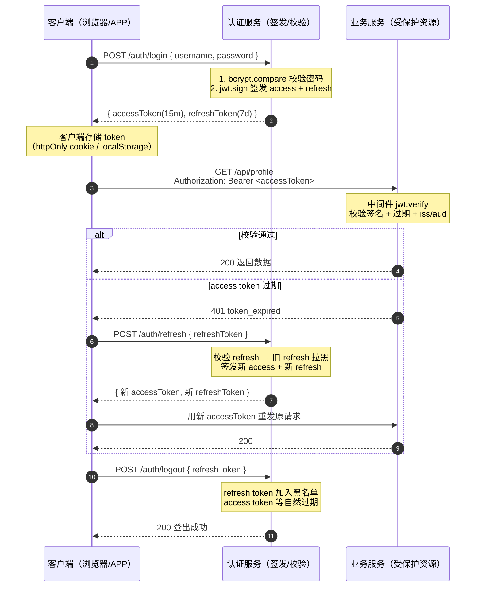

# Day18 - JWT 身份认证

> 前端做单页应用、跨端 SDK 时，"用户登录"看起来只是一个 `POST /login` 拿到 token 后塞进 `Authorization` 头。但当你自己要写后端鉴权、设计 AI 推理网关、给多端（Web / 小程序 / IoT / Agent）签发凭证时，就会直面一连串问题：**密码到底怎么存？token 为什么要分成 access 和 refresh？token 过期了怎么续？用户点登出后 token 还能用怎么办？localStorage 里的 token 被 XSS 偷了怎么办？** 本篇以 JWT 为主线，把这些"知道但讲不清"的鉴权知识一次打通，并落地为一个可跑的 Express 认证服务，为后续 AI 网关、模型 API 鉴权打下基础。

---

## 目录

- [一、学习目标](#一学习目标)
- [二、理论知识讲解](#二理论知识讲解)
  - [2.1 认证 vs 授权](#21-认证-vs-授权)
  - [2.2 Session/Cookie 认证 vs JWT Token 认证](#22-sessioncookie-认证-vs-jwt-token-认证)
  - [2.3 JWT 的三段式结构](#23-jwt-的三段式结构)
  - [2.4 JWT 签名算法](#24-jwt-签名算法)
  - [2.5 JWT 工作流程](#25-jwt-工作流程)
- [三、JWT 详解](#三jwt-详解)
  - [3.1 三个核心 API](#31-三个核心-api)
  - [3.2 payload 常用字段](#32-payload-常用字段)
  - [3.3 过期时间策略](#33-过期时间策略)
  - [3.4 refresh token 刷新机制](#34-refresh-token-刷新机制)
  - [3.5 登出问题](#35-登出问题)
- [四、密码安全](#四密码安全)
  - [4.1 为什么不能明文存密码](#41-为什么不能明文存密码)
  - [4.2 哈希算法演进](#42-哈希算法演进)
  - [4.3 bcrypt 用法](#43-bcrypt-用法)
  - [4.4 密码强度校验](#44-密码强度校验)
- [五、在 Express 中实现 JWT 认证](#五在-express-中实现-jwt-认证)
- [六、安全最佳实践](#六安全最佳实践)
- [七、完整认证流程](#七完整认证流程)
- [八、关键知识点总结](#八关键知识点总结)
- [九、实战练习](#九实战练习)

---

## 一、学习目标

完成本篇学习后，你应当能够：

1. 准确区分**认证（Authentication）**与**授权（Authorization）**，并能用一句话向新人解释清楚。
2. 用对比表格说出 Session/Cookie 认证与 JWT Token 认证在**状态、存储、扩展性、CSRF/XSS、移动端友好度**上的差异，能根据场景选型。
3. 拆解 JWT 的三段式结构 `Header.Payload.Signature`，能解释为什么三段都用 base64url 编码、签名到底签的是什么内容。
4. 区分 HS256（对称）与 RS256 / ES256（非对称）三种算法的密钥管理与适用场景，知道为什么微服务间鉴权常选 RS256。
5. 说出 `jwt.sign` / `jwt.verify` / `jwt.decode` 三者的差异，能列举 `sub / iat / exp / iss / aud / jti` 六个标准字段的作用。
6. 解释 access token 短期 + refresh token 长期机制，并能实现 refresh token 轮转（rotation）与黑名单撤销。
7. 说明为什么不能明文存密码、为什么 MD5/SHA1 已不安全、bcrypt 的 cost factor 如何抵御暴力破解。
8. 在 Express 中编写 JWT 中间件：解析 `Authorization: Bearer <token>`、校验、挂载 `req.user`、按错误类型返回 401。
9. 针对 token 存储位置（httpOnly cookie vs localStorage）做 XSS / CSRF 取舍，并说出至少 5 条 JWT 生产安全最佳实践。
10. 把注册 → 登录 → 受保护资源 → 刷新 → 登出串成一个完整闭环，并知道每一步可能出现的攻击面。

---

## 二、理论知识讲解

### 2.1 认证 vs 授权

这两个词长得像、读着像，但回答的是两个不同的问题：

| 维度 | 认证 Authentication | 授权 Authorization |
|------|---------------------|---------------------|
| 回答的问题 | **你是谁？** | **你能做什么？** |
| 输入 | 凭证（密码 / OTP / 生物特征 / token） | 身份 + 资源 + 动作 |
| 输出 | 一个可识别的主体（user） | 允许 / 拒绝 |
| 典型时机 | 登录时一次性完成 | 每次访问资源时 |
| 失败响应 | 401 Unauthorized | 403 Forbidden |
| 举例 | 用账号密码登录成功 → 知道你是 alice | alice 试图删除 bob 的文章 → 拒绝 |
| 通俗比喻 | 检票口验身份证 | 进场后只能坐自己的座位 |

> 实战口诀：**401 是"不知道你是谁"，403 是"知道你是谁但不让你干"**。前端拿到 401 应触发登录/刷新流程；拿到 403 应提示"无权限"而非弹登录框。

### 2.2 Session/Cookie 认证 vs JWT Token 认证

这是后端面试最经典的鉴权对比题。**核心区别在于"状态"放在哪**：

| 维度 | Session/Cookie | JWT Token |
|------|----------------|-----------|
| **状态** | 有状态：服务端存 session | 无状态：服务端不存任何登录态 |
| **存储位置** | 服务端（内存 / Redis）+ 客户端 Cookie | 客户端（Cookie / localStorage / 内存） |
| **标识** | sessionId（随机串，无意义） | token（自包含 payload） |
| **扩展性** | 多实例需共享 session（粘性会话或 Redis） | 天然友好，任何实例都能验签 |
| **CSRF** | 易受 CSRF（Cookie 自动携带） | 默认不易受 CSRF（手动塞 Header） |
| **XSS** | httpOnly Cookie 抗 XSS 偷取 | localStorage 易被 XSS 偷取 |
| **移动端友好** | 一般（Cookie 在 App/小程序里不自然） | 好（一个字符串随便放） |
| **撤销** | 服务端删 session 即刻生效 | 难（需黑名单，破坏无状态） |
| **流量** | sessionId 短，服务端每次查库 | token 较长，但服务端无需查库 |
| **跨域** | Cookie 跨域配置繁琐 | 跨域只需 CORS 放行 Header |
| **典型场景** | 传统 Web 单体、SSO | API 网关、移动端、微服务、AI 推理服务 |

> 选型经验：**纯浏览器 + 同域 + 强撤销需求 → Session/Cookie**；**API / 多端 / 跨域 / 微服务 → JWT**。两者并非互斥，可组合：浏览器端用 httpOnly Cookie 存 JWT，移动端用 localStorage 存 JWT，服务端统一用 JWT 验签。

### 2.3 JWT 的三段式结构

JWT（JSON Web Token，RFC 7519）由三段以 `.` 分隔的字符串组成：

```
xxxxx.yyyyy.zzzzz
  │     │     │
  │     │     └─ Signature  签名（用 secret 对前两段做 HMAC/RSA 签名后的结果）
  │     │
  │     └─── Payload    载荷（claims 声明，可见但不可篡改）
  │
  └───────── Header    头部（算法 + 类型）
```

每一段都是 **base64url 编码**（不是加密！任何人都能解码）。base64url 与普通 base64 的差异是把 `+` 换成 `-`、`/` 换成 `_`、去掉 `=` 填充，以便安全放进 URL/Header。

**Header 示例（解码后）：**

```json
{ "alg": "HS256", "typ": "JWT" }
```

**Payload 示例（解码后）：**

```json
{
  "sub": "user-0001",
  "role": "admin",
  "iat": 1784890549,
  "exp": 1784894149
}
```

**Signature 计算方式（HS256）：**

```
HMACSHA256(
  base64url(Header) + "." + base64url(Payload),
  secret
)
```

> 关键认知：**payload 是明文！** 不要把身份证号、银行卡号、密码放进去。JWT 解决的是"防篡改"而非"防偷看"。如果需要保密，要用 JWE（JSON Web Encryption）而非 JWT。

### 2.4 JWT 签名算法

| 算法 | 类型 | 密钥 | 验签方 | 适用场景 |
|------|------|------|--------|----------|
| **HS256** | 对称 HMAC | 单一 secret，签发与验签同密钥 | 必须信任签发方 | 单体应用、内部服务、快速上手 |
| **RS256** | 非对称 RSA | 私钥签发，公钥验签 | 任何持有公钥者 | 微服务、开放平台、OAuth2 |
| **ES256** | 非对称 ECDSA | 私钥签发，公钥验签 | 任何持有公钥者 | 移动端 / IoT（密钥短、性能好） |

**为什么微服务常选 RS256？** 因为验签只需要公钥，可以把公钥分发给所有服务（甚至做成 JWKS endpoint），而签发权集中在认证中心，私钥绝不外泄。HS256 则要求每个验签服务都持有 secret，secret 一旦泄漏全平台沦陷。

> 注意：**永远不要接受 `alg: none` 的 token**。`jsonwebtoken` 默认会拒绝，但自实现验签时务必白名单算法。

### 2.5 JWT 工作流程



整个流程的精髓是 **"无状态验签 + 有状态撤销"**：业务服务不需要查数据库就能验签（无状态带来横向扩展能力），而真正需要"踢人下线"时用 refresh token 黑名单来兜底。

---

## 三、JWT 详解

### 3.1 三个核心 API

`jsonwebtoken` 库的三个核心方法：

| API | 作用 | 是否验签 | 是否阻塞 | 典型场景 |
|-----|------|----------|----------|----------|
| `jwt.sign(payload, secret, options)` | 签发 token | — | 同步/异步 | 登录成功后 |
| `jwt.verify(token, secret, options)` | 校验 + 解码 | ✓ | 同步/异步 | 鉴权中间件 |
| `jwt.decode(token)` | 仅解码 payload | ✗ | 同步 | 调试、显示用户信息 |

**`jwt.sign` 常用 options：**

```js
jwt.sign(
  { sub: 'user-001', role: 'admin' },   // payload
  SECRET,                                // 密钥
  {
    expiresIn: '15m',                    // 过期时间，字符串或秒数
    issuer: 'my-app',                    // iss：签发者
    audience: 'my-client',               // aud：接收方
    subject: 'user-001',                 // sub（也可在 payload 里写）
    notBefore: '0s',                     // nbf：生效时间
    algorithm: 'HS256',                  // 算法，默认 HS256
  }
);
```

**`jwt.verify` 常用 options：**

```js
jwt.verify(token, SECRET, {
  issuer: 'my-app',         // 校验 iss
  audience: 'my-client',    // 校验 aud
  algorithms: ['HS256'],    // 白名单算法（防 alg 混淆攻击）
  clockTolerance: 30,       // 时钟容差秒数（防集群时钟漂移）
  ignoreExpiration: false,  // 是否忽略 exp（默认 false，必须校验）
});
```

**三类错误：**

| 错误名 | 触发条件 | 附加字段 | 处理建议 |
|--------|----------|----------|----------|
| `TokenExpiredError` | exp 已过 | `expiredAt` | 401，前端触发刷新 |
| `JsonWebTokenError` | 签名错 / 格式错 / iss/aud 不符 | — | 401，拒绝并登出 |
| `NotBeforeError` | nbf 未到 | `date` | 403，token 未生效 |

### 3.2 payload 常用字段

JWT 的 payload 由 **claims（声明）** 组成，分两类：

**标准 claims（RFC 7519）：**

| 字段 | 全称 | 含义 | 典型值 |
|------|------|------|--------|
| `iss` | Issuer | 签发者 | `"my-app"` |
| `sub` | Subject | 主体（通常用户 ID） | `"user-0001"` |
| `aud` | Audience | 接收方 | `"web-client"` |
| `exp` | Expiration | 过期时间（Unix 秒） | `1784894149` |
| `nbf` | Not Before | 生效时间 | `1784890549` |
| `iat` | Issued At | 签发时间 | `1784890549` |
| `jti` | JWT ID | 唯一标识 | `"a3f9..."` |

**自定义 claims：**

```js
{ sub: 'user-001', role: 'admin', dept: 'ai-team', tier: 3 }
```

> 注意事项：
> - payload 不要放敏感信息（明文可见）
> - payload 越小越好（每个请求都要带，影响带宽）
> - `sub` 用不可猜的 ID（数据库主键 / UUID），别用 username

### 3.3 过期时间策略

| 策略 | access token 时长 | refresh token 时长 | 优缺点 |
|------|-------------------|---------------------|--------|
| 单 token | 长期（30 天） | — | 简单但无法撤销，泄露风险大 |
| 双 token | 短期（15 min） | 长期（7 d） | **推荐**，兼顾安全与体验 |
| 极短 + sliding | 5 min | 1 d | 高安全场景（金融），刷新频繁 |

**为什么 access token 要短？** 因为 access token 用于访问所有 API，一旦泄露攻击者能直接调用。短期 + refresh 机制让"泄露窗口"被压缩到分钟级。

**为什么 refresh token 可以长？** 因为 refresh token 只用于一个接口（`/auth/refresh`），监控单接口异常比监控所有 API 容易；且 refresh token 可随时撤销。

### 3.4 refresh token 刷新机制

```
客户端                    服务端
  │                         │
  │ access 过期             │
  │ → 自动触发 refresh      │
  │ POST /auth/refresh      │
  │   { refreshToken }      │
  │ ───────────────────────→│
  │                         │ 1. verifyRefreshToken
  │                         │ 2. 检查黑名单
  │                         │ 3. ★ 旧 refresh 拉黑
  │                         │ 4. 签新 access + 新 refresh
  │ ←──────────────────────│
  │ { new access, new refresh }
  │                         │
  │ 用新 access 重发原请求  │
```

**轮转（rotation）的好处：** 旧 refresh token 一旦用过就失效，攻击者即使偷到 refresh token 并抢先用，合法用户下次刷新会失败并察觉异常。

**轮转的代价：** 黑名单会增长。生产环境用 Redis 存黑名单，并设置 TTL = refresh token 剩余有效期，让条目自动过期清理。

### 3.5 登出问题

JWT 的无状态特性带来一个尴尬：**access token 一旦签发就无法撤销**（除非等它自然过期）。登出只能做到：

1. **客户端删除 token**：基础操作，但 token 已发出的副本仍可用到过期。
2. **refresh token 黑名单**：阻止对方换新 access token，把窗口限制在 access token 剩余寿命内。
3. **access token 黑名单**：彻底撤销，但破坏无状态、增加每请求查 Redis 的开销。
4. **超短 access token（5 min）+ 黑名单 refresh**：折中方案。

> 实战心法：**对一般业务，"客户端删除 + refresh 黑名单 + 短 access token"足够**；对极敏感操作（改密码、转账），独立做二次验证（短信 OTP / 二次密码），而不是依赖 token 撤销。

---

## 四、密码安全

### 4.1 为什么不能明文存密码

| 方案 | 风险 |
|------|------|
| 明文存储 | 数据库泄漏 → 全员密码裸奔；内部 DBA 可看 |
| MD5 / SHA1 哈希 | 彩虹表秒破；快速哈希便于 GPU 暴力枚举 |
| MD5 + 固定盐 | 盐泄漏后仍可针对该盐爆破 |
| **bcrypt / scrypt / argon2** | **慢哈希 + 随机盐，专门抵御暴力破解** |

**真实数据：** 根据公开泄漏事件统计，超过 80% 的用户在多个网站复用密码。你的库存明文一旦泄漏，等于把用户在银行、邮箱、社交平台的账号一起交出去。这就是为什么密码**必须**用专门的密码哈希算法存储。

### 4.2 哈希算法演进

| 算法 | 类型 | 是否安全 | 说明 |
|------|------|----------|------|
| MD5 | 通用哈希 | ❌ 已破 | 1996 年发现碰撞，2004 年彻底破解；**绝对不要用于密码** |
| SHA1 | 通用哈希 | ❌ 已破 | 2017 年 SHAttered 公开碰撞 |
| SHA256 | 通用哈希 | ⚠️ 不推荐 | 安全但**太快**，GPU 可每秒亿次枚举 |
| PBKDF2 | 密码哈希 | ✅ 可用 | NIST 标准，但迭代次数需调到极高 |
| **bcrypt** | 密码哈希 | ✅ **推荐** | 内置盐、cost factor，Node 生态最成熟 |
| scrypt | 密码哈希 | ✅ 推荐 | 同时占 CPU + 内存，抗 ASIC |
| argon2 | 密码哈希 | ✅ **最强** | 2015 年密码哈希竞赛冠军，抗 GPU/ASIC |

> 关键认知：**密码哈希要"慢"，通用哈希要"快"**。SHA256 设计目标是文件校验，越快越好；bcrypt 设计目标是密码存储，故意慢到几十毫秒，让暴力枚举成本爆炸。

### 4.3 bcrypt 用法

```js
const bcrypt = require('bcryptjs');

// 方式一：分两步（genSalt + hash）
const salt = bcrypt.genSaltSync(10);          // cost = 10
const hash = bcrypt.hashSync('mypassword', salt);

// 方式二：一步（推荐，更简洁）
const hash2 = bcrypt.hashSync('mypassword', 10);

// 校验
const ok = bcrypt.compareSync('mypassword', hash);   // true
const no = bcrypt.compareSync('wrong', hash);        // false
```

**bcrypt 哈希字符串的结构（共 60 字符）：**

```
$2a$10$N9qo8uLOickgx2ZMRZoMyeIjZAgcfl7p92ldGxad68LJZdL17lhWy
^^^ ^^ ^^^^^^^^^^^^^^^^^^^^^^^^^^ ^^^^^^^^^^^^^^^^^^^^^^^^^^^^
 │   │  │                          │
 │   │  │                          └─ 31 位哈希结果
 │   │  └──────────────────────────── 22 位 base64 盐
 │   └─────────────────────────────── cost factor（工作因子）
 └───────────────────────────────────── 算法标识（2a / 2b / 2y）
```

**关键点：哈希结果里自带盐！** 所以你不需要在数据库里单独存 salt 字段，存 hash 一列即可。`compareSync` 会从 hash 中解析出 salt 和 cost，重新算一次哈希再比对。

**cost factor（工作因子）：**

| cost | 单次哈希耗时（参考） | 含义 |
|------|----------------------|------|
| 8 | ~40 ms | 测试环境 |
| 10 | ~100 ms | **默认值，生产推荐下限** |
| 12 | ~400 ms | 敏感账户推荐 |
| 14 | ~1.6 s | 极高安全场景 |

cost 每加 1，耗时翻倍。攻击者暴力枚举一个 8 位密码，cost=10 时假设每次 100ms，全空间枚举约 6000 年。这就是"慢哈希"的威力。

> 选型建议：**生产 cost ≥ 10，登录响应时间在 100~500ms 之间用户无感**。每 2 年评估一次硬件升级，必要时把 cost 提高 1。

### 4.4 密码强度校验

哈希只解决"密码泄漏后不易被逆推"，强度校验解决"用户别用 `123456`"。最简规则：

```js
function checkPasswordStrength(pwd) {
  return pwd.length >= 8
      && /[A-Z]/.test(pwd)
      && /[a-z]/.test(pwd)
      && /[0-9]/.test(pwd)
      && /[^A-Za-z0-9]/.test(pwd);
}
```

进阶可使用 [`zxcvbn`](https://github.com/dropbox/zxcvbn)（Dropbox 出品）做基于熵的评分，能识别 `qwerty`、`admin123` 这类"看起来复杂其实弱"的密码。

---

## 五、在 Express 中实现 JWT 认证

### 5.1 登录接口签发 token

```js
app.post('/auth/login', async (req, res) => {
  const { username, password } = req.body;
  const result = userStore.verifyCredential(username, password); // 内部 bcrypt.compare
  if (!result.ok) return res.status(401).json({ error: 'invalid_credential' });

  const accessToken = jwt.sign(
    { sub: result.user.sub, role: result.user.role },
    ACCESS_SECRET,
    { expiresIn: '15m', issuer, audience }
  );
  res.json({ accessToken });
});
```

### 5.2 auth 中间件校验 Bearer token

```js
function authRequired() {
  return (req, res, next) => {
    const header = req.headers.authorization || '';
    const token = header.startsWith('Bearer ') ? header.slice(7) : null;
    if (!token) return res.status(401).json({ error: 'no_token' });

    jwt.verify(token, ACCESS_SECRET, { issuer, audience }, (err, decoded) => {
      if (err) return handleJwtError(err, res);   // 区分过期 / 篡改
      req.user = decoded;                          // 挂载到 req.user
      next();
    });
  };
}
```

### 5.3 保护路由

```js
app.get('/auth/me', authRequired(), (req, res) => {
  // req.user 由中间件挂载，可放心使用
  res.json({ user: userStore.findBySub(req.user.sub) });
});

// 角色限制
app.get('/admin/users', authRequired({ roles: ['admin'] }), handler);
```

### 5.4 refresh token 接口

```js
app.post('/auth/refresh', (req, res) => {
  const result = refreshTokens(req.body.refreshToken, userPayloadProvider);
  if (!result.ok) return res.status(401).json({ error: result.error });
  res.json({ accessToken: result.accessToken, refreshToken: result.refreshToken });
});
```

### 5.5 错误处理（401 区分场景）

| 错误 | HTTP | code | 前端动作 |
|------|------|------|----------|
| 未带 token | 401 | `no_token` | 跳登录 |
| token 过期 | 401 | `token_expired` | 自动刷新后重试 |
| token 篡改 | 401 | `invalid_token` | 强制登出 |
| issuer/audience 不符 | 401 | `invalid_token` | 强制登出 |
| token 未生效 | 403 | `token_not_active` | 提示稍后再试 |

---

## 六、安全最佳实践

### 6.1 secret 管理

- ✅ 用强随机生成：`crypto.randomBytes(48).toString('base64url')` 至少 32 字节
- ✅ 存环境变量 / 密钥管理服务（AWS KMS / Vault / 阿里云 KMS），**永不进代码库**
- ✅ access secret 与 refresh secret **分开**
- ❌ 不要用 `jwt-secret`、`mysecret` 这种弱口令
- ❌ 不要把 `.env` 提交进 Git（加进 `.gitignore`）

### 6.2 HTTPS 强制

JWT 的 token 一旦在 HTTP 明文传输被抓包，等同于密码泄漏。生产环境：

- 全站 HSTS + 301 跳转 HTTPS
- 反向代理（Nginx / Caddy）终结 TLS，Node 服务监听内网
- 开发环境用 `mkcert` 生成本地可信证书

### 6.3 token 存储位置取舍

| 存储位置 | XSS 偷取 | CSRF | 跨域 | 推荐度 |
|----------|----------|------|------|--------|
| localStorage | ❌ 易被 XSS 偷 | ✅ 不受 CSRF | ✅ 简单 | ⚠️ 谨慎，需强 CSP |
| sessionStorage | ❌ 易被 XSS 偷 | ✅ 不受 CSRF | ✅ 简单 | ⚠️ 关闭标签即失效 |
| httpOnly Cookie | ✅ JS 读不到 | ❌ 易受 CSRF | ⚠️ 配置繁琐 | ✅ **Web 端推荐** |
| 内存（变量） | ✅ 难偷 | ✅ 不受 CSRF | — | ✅ 但刷新会丢，需配合刷新机制 |

**Web 端最佳实践：** access token 放内存，refresh token 放 httpOnly + SameSite=Strict 的 Cookie。这样 XSS 偷不到 refresh token，刷新后 access token 又能恢复。

### 6.4 CSRF 防护（用 Cookie 时）

- `SameSite=Strict`：跨站不带 Cookie，最严格
- `SameSite=Lax`：导航时带，子请求不带（Chrome 默认）
- 双重 Cookie：表单里再带一个随机 token，服务端比对
- 仅 POST/PUT/DELETE 写操作允许 Cookie 鉴权

### 6.5 敏感操作二次验证

转账、改密码、删除账号等"高破坏性"操作**不能只凭 access token**，要：

- 二次密码确认
- 短信 / 邮件 OTP
- 生物特征（指纹 / 面容）
- 操作后立即邮件通知

### 6.6 限流防爆破

- 登录接口：按 IP + username 双维度限流（如 5 次/分钟）
- 失败计数：连续失败 N 次后锁定账户或加图形验证码
- 用 `express-rate-limit` 等中间件快速实现

```js
const rateLimit = require('express-rate-limit');
const loginLimiter = rateLimit({
  windowMs: 15 * 60 * 1000,   // 15 分钟
  max: 5,                      // 最多 5 次
  message: { error: 'too_many_attempts' }
});
app.post('/auth/login', loginLimiter, handler);
```

---

## 七、完整认证流程

```
┌────────────────────────────────────────────────────────────────────┐
│                          注册（Register）                            │
│  1. 接收 { username, password }                                     │
│  2. 密码强度校验                                                    │
│  3. bcrypt.hash(password, 10) → passwordHash                       │
│  4. 存入数据库：{ sub, username, passwordHash, role }                │
│  5. 返回脱敏用户信息（不含 passwordHash）                            │
└────────────────────────────────────────────────────────────────────┘
                              │
                              ▼
┌────────────────────────────────────────────────────────────────────┐
│                          登录（Login）                               │
│  1. 接收 { username, password }                                     │
│  2. 查库取 passwordHash                                            │
│  3. bcrypt.compare(password, passwordHash)                         │
│  4. 失败 → 401（不论用户名是否存在都走一次 compare 防时序侧信道）    │
│  5. 成功 → jwt.sign 签发：                                          │
│       access token  (15m, payload: { sub, role })                  │
│       refresh token (7d,  payload: { sub, jti })                   │
│  6. 返回 { accessToken, refreshToken }                              │
└────────────────────────────────────────────────────────────────────┘
                              │
                              ▼
┌────────────────────────────────────────────────────────────────────┐
│                    访问受保护资源（Protected API）                   │
│  1. 中间件解析 Authorization: Bearer <accessToken>                  │
│  2. jwt.verify 校验签名 + exp + iss + aud                          │
│  3. 失败 → 401（区分 token_expired / invalid_token）                │
│  4. 成功 → req.user = decoded，next()                               │
│  5. 角色校验（可选）：req.user.role ∈ allowed?                      │
│  6. 业务 handler 执行                                               │
└────────────────────────────────────────────────────────────────────┘
                              │
                   access token 过期
                              ▼
┌────────────────────────────────────────────────────────────────────┐
│                       刷新（Refresh）                                │
│  1. 接收 { refreshToken }                                           │
│  2. verifyRefreshToken：校验签名 + 过期 + 黑名单                    │
│  3. ★ 旧 refresh token 拉黑（rotation）                             │
│  4. 签新 access + 新 refresh                                        │
│  5. 返回新 token 对                                                  │
└────────────────────────────────────────────────────────────────────┘
                              │
                              ▼
┌────────────────────────────────────────────────────────────────────┐
│                       登出（Logout）                                 │
│  1. 接收 { refreshToken }                                           │
│  2. refresh token 加入黑名单（jti）                                  │
│  3. access token 无法立即撤销，等其自然过期（15 min）                │
│  4. 客户端清空本地 token                                             │
│  5. 返回 200                                                         │
└────────────────────────────────────────────────────────────────────┘
```

---

## 八、关键知识点总结

1. **认证回答"你是谁"，授权回答"你能做什么"**。401 vs 403 是鉴权错误处理的分水岭。
2. **Session 有状态、JWT 无状态**。Session 撤销容易但难扩展，JWT 扩展容易但撤销难。
3. **JWT 三段式：Header.Payload.Signature**，前两段 base64url 编码（明文！），第三段是签名。签名防篡改不防偷看。
4. **HS256 对称、RS256/ES256 非对称**。微服务选 RS256，把公钥分发给验签方、私钥集中在认证中心。
5. **payload 不放敏感信息**，但 `sub / iat / exp / iss / aud / jti` 六个标准字段要会用。
6. **access token 短 + refresh token 长**是当前主流。refresh token 轮转 + 黑名单是"无状态"与"可撤销"的折中。
7. **密码必须用慢哈希**：bcrypt / scrypt / argon2。MD5/SHA1 已破，SHA256 太快。bcrypt 哈希自带盐，cost ≥ 10。
8. **`Authorization: Bearer <token>` 是事实标准**。中间件解析、验签、挂 `req.user` 三步走。
9. **错误要分类**：`TokenExpiredError` 触发刷新，`JsonWebTokenError` 强制登出，前端逻辑完全不同。
10. **安全六件套**：HTTPS 强制、secret 进环境变量、httpOnly Cookie 存 token、SameSite 防 CSRF、敏感操作二次验证、限流防爆破。
11. **登出无法立刻杀 access token**——这是 JWT 无状态的代价。超短 access token + refresh 黑名单是工程上的最优解。
12. **永远校验 `alg` 白名单**，永远拒绝 `alg: none`，永远不把 secret 写进代码库。

---

## 九、实战练习

### 练习 1：实现一个带角色权限的中间件

在现有 `auth-middleware.js` 基础上，新增一个 `requirePermission(perm)` 中间件，要求用户的 `role` 对应一组预定义权限（如 `admin` → `['read', 'write', 'delete']`，`editor` → `['read', 'write']`，`user` → `['read']`）。访问 `/api/articles/:id` 的 DELETE 方法时必须具备 `delete` 权限，否则返回 403。

**验收标准：**
- 用 alice（user）登录后调 DELETE → 403
- 用 admin 登录后调 DELETE → 200 / 204

### 练习 2：把内存黑名单换成带 TTL 的版本

当前 `refresh-token.js` 用 `Set` 存黑名单，长期运行会无限增长。请：

1. 引入一个 `Map<jti, expiresAt>`，`expiresAt` 来自 refresh token 的 `exp`
2. 启动一个定时器，每 10 分钟清理一次过期条目
3. 加一个 `/admin/blacklist` 接口（仅 admin 可访问）返回当前黑名单大小与最早过期时间

**验收标准：** 7 天后黑名单大小回归 0，内存不持续增长。

### 练习 3：把 access token 改成 httpOnly Cookie

把当前返回在 JSON body 里的 `accessToken` 改为通过 `Set-Cookie` 写入浏览器，要求：

- `httpOnly: true`
- `secure: true`（生产）
- `sameSite: 'Strict'`
- `maxAge: 15 * 60 * 1000`
- 同时配套加 CSRF Token（双重 Cookie 模式）

并思考：为什么 refresh token 仍可以放 JSON body，而 access token 推荐放 Cookie？

**提示：** access token 每次请求都要带，放 Cookie 自动携带最省心；refresh token 只在 `/auth/refresh` 用一次，放 body 反而更安全。

---

## 附：代码结构

```
Day18 - JWT身份认证/
├── README.md                  # 本文档
└── Code/
    ├── package.json           # 依赖：express / jsonwebtoken / bcryptjs
    ├── password-hash.js       # bcrypt 用法、cost 对比、密码强度校验
    ├── jwt-sign-verify.js     # sign/verify/decode、过期、错误类型演示
    ├── auth-middleware.js     # Express JWT 中间件（Bearer 解析、错误分类）
    ├── user-store.js          # 内存用户存储（注册哈希、登录校验、防时序侧信道）
    ├── refresh-token.js       # access + refresh 双 token、轮转、黑名单
    └── server.js              # 完整认证服务（注册/登录/me/refresh/logout/admin）
```

**运行方式：**

```bash
cd "Day18 - JWT身份认证/Code"
npm install
node password-hash.js      # 单独跑密码哈希演示
node jwt-sign-verify.js    # 单独跑 JWT API 演示
node server.js             # 启动完整认证服务 → http://localhost:3000
```

`server.js` 文件头注释里附有 13 条 curl 命令，覆盖了注册、登录、访问受保护资源、刷新、登出、角色限制、token 过期等所有场景，可直接复制到终端测试。
